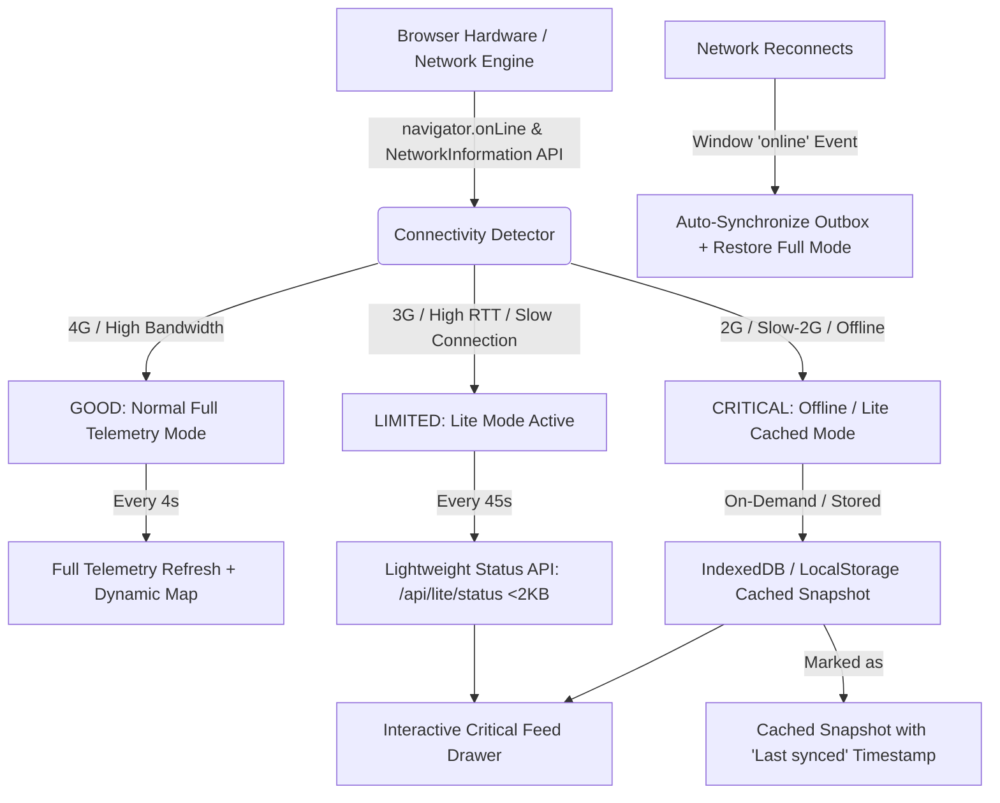

# NERALIS — Connectivity-Aware / Low-Network Mode Documentation

## 1. Overview & Operational Mandate

In the mountainous terrain of the **North Eastern Region (NER)** of India, telecommunication infrastructure frequently faces severe degradation due to heavy monsoons, landslides, deep river gorges, and remote forest valleys. Field officers, logistics convoys, and emergency relief workers often operate in **2G, intermittent 3G, or zero-connectivity deadzones**.

The **NERALIS Connectivity-Aware / Low-Network Mode** provides an intelligent, automated fallback architecture that:
- Detects network quality in real-time.
- Automatically transitions the UI into a **Lite Mode** under limited (3G) or critical (2G/offline) conditions.
- Uses a lightweight endpoint (`/api/lite/status`) with compressed payloads (< 1.5 KB vs. 100+ KB full state).
- Throttles background polling and heavy animations to conserve battery and bandwidth.
- Employs **IndexedDB & LocalStorage durable caching** to display last-known truthful snapshots with timestamps when offline.
- Seamlessly re-syncs and returns to Normal High-Speed Mode when connectivity is restored.

---

## 2. Architecture & Data Flow



---

## 3. Connectivity Detection Implementation

The frontend evaluates browser telemetry using standard Web APIs with safe progressive enhancement fallbacks:

```typescript
// Classification Rules
1. Offline Detection:
   !navigator.onLine -> 'CRITICAL' (effectiveType: 'offline')

2. Network Information API (where supported):
   - effectiveType: 'slow-2g' | '2g' -> 'CRITICAL'
   - effectiveType: '3g' | RTT > 800ms | Downlink < 1.0 Mbps | saveData: true -> 'LIMITED'
   - effectiveType: '4g' -> 'GOOD'

3. Unsupported Browsers (e.g. Safari / Firefox):
   - Graceful fallback using navigator.onLine and ping health checks.
```

### Event Listeners:
- `window.addEventListener('online', ...)`: Triggers automatic reconnection, synchronizes queued outbox mutations, and restores full-rate polling.
- `window.addEventListener('offline', ...)`: Engages offline mode immediately and marks state as cached.
- `navigator.connection.addEventListener('change', ...)`: Dynamically reclassifies network status on mobile cell tower handoffs.

---

## 4. Lite Mode Behavior & Resource Optimization

When connection status enters `LIMITED` or `CRITICAL`:

1. **Indicator Banner:**
   - Displays a non-intrusive status banner under the Navbar:
     - `⚠ Limited Connectivity (3G) — Lite Mode Active`
     - `🔴 2G Low-Network / Offline — Lite Mode Engaged`
   - Displays `[CACHED SNAPSHOT]` or `[LIGHTWEIGHT API (<2 KB)]` badge with `Last synced: X min ago`.

2. **Prioritized Critical Logistics:**
   - Active fleet vehicle status, cold-chain temperature (2.0°C–8.0°C), and next checkpoint.
   - Hazard corridors and road blockades (e.g., NH-10 Teesta Valley, NH-13).
   - Critical bridge structural telemetry (< 85% health).
   - Active NDMA CAP v1.2 emergency alerts.

3. **Disabled / Throttled Heavy Operations:**
   - Pauses full 8-endpoint parallel data fetching.
   - Reduces polling from 4s/15s down to 45s–60s (or pauses completely when offline).
   - Throttles high-frequency telemetry coordinate jitter and heavy CSS animations.

4. **Collapsible Critical Feed Drawer:**
   - Allows field officers to quickly inspect critical entities in a low-bandwidth, compact card view.

---

## 5. Lightweight API Schema (`GET /api/lite/status`)

### Endpoint:
`GET /api/lite/status`

### Payload Size:
`~1.2 KB` (compared to > 120 KB across full individual entity endpoints)

### Response Structure:
```json
{
  "timestamp": "2026-09-01T18:15:30.123456",
  "mode": "LITE_CRITICAL",
  "payload_size_kb": 1.2,
  "vehicles": [
    {
      "vehicle_id": "TR-01",
      "status": "OPEN",
      "risk_score": 0.15,
      "last_known_location": "Guwahati Hub → Shillong Civil Hospital",
      "next_checkpoint": "Shillong Civil Hospital",
      "current_lat": 26.1445,
      "current_lng": 91.7362,
      "speed_kmh": 42,
      "cold_chain_temp_c": 3.8,
      "alert": null
    }
  ],
  "corridors_at_risk": [
    {
      "id": "SEG-12",
      "name": "NH-10 (Siliguri - Gangtok)",
      "status": "CLOSED",
      "risk_score": 92,
      "hazard_type": "Teesta River Flood & Landslide Debris"
    }
  ],
  "critical_bridges": [
    {
      "id": "BR-03",
      "name": "Coronation Bridge (Teesta)",
      "status": "RESTRICTED",
      "structural_health_pct": 54
    }
  ],
  "critical_alerts": [
    {
      "id": "ALT-2026-0891",
      "tier": "T4 - CRITICAL",
      "title": "Coronation Bridge / NH-10 Teesta Corridor Blockade",
      "corridor_id": "SEG-12",
      "message": "NH-10 Teesta Valley corridor closed due to debris surge at km 29. Mandatory diversion active.",
      "timestamp": "2026-08-26T08:15:00+05:30"
    }
  ],
  "districts_count": 89
}
```

---

## 6. Caching Strategy & Offline Fallback

- **Storage Layers:**
  - **IndexedDB (`offlineStore`):** Stores durable outbox mutations (offline field reports, road overrides, alert acknowledgments).
  - **LocalStorage (`neralis_cached_lite_data`):** Caches the latest successful `/api/lite/status` snapshot with an ISO timestamp.
- **Truthful Status Display:**
  - When offline or when an API call fails, data is explicitly marked as `[CACHED SNAPSHOT]` with a relative timestamp (`Last synced: 2 min ago`).
  - No synthetic "live" movement is shown during complete disconnection.

---

## 7. How to Test Using Chrome DevTools & In-App Simulator

### Option A: In-App Network Simulator (Instant Hackathon Demo)
1. Look at the **Connectivity Banner** directly below the Navbar, or visit **Module 08 (Offline & Resilience)**.
2. Click any of the simulation pills:
   - `Auto`: Automatic browser hardware detection.
   - `4G`: Forces full online mode (high-speed).
   - `3G`: Engages **Lite Mode (Limited Connectivity)**.
   - `2G`: Engages **Critical Bandwidth Mode** (< 2 KB endpoint).
   - `Offline`: Simulates complete network disconnection with cached snapshots.

### Option B: Chrome DevTools Network Throttling
1. Open Chrome DevTools (`F12` or `Ctrl+Shift+I` / `Cmd+Option+I`).
2. Go to the **Network** tab.
3. In the throttling dropdown (defaults to *No throttling*):
   - Select **Slow 3G** or **Fast 3G** → Watch the banner transition to `⚠ Limited Connectivity (3G) — Lite Mode Active`.
   - Select **Offline** → Watch the banner transition to `🔴 2G Low-Network / Offline — Lite Mode Engaged [CACHED SNAPSHOT]`.
   - Select **No throttling** → Observe instant recovery, toast notification, and outbox synchronization.

---

## 8. Browser Compatibility & Fallbacks

| Feature | Chromium (Chrome, Edge, Brave) | Firefox | Safari (macOS / iOS) |
|---|---|---|---|
| `navigator.onLine` | ✅ Supported | ✅ Supported | ✅ Supported |
| `online` / `offline` Events | ✅ Supported | ✅ Supported | ✅ Supported |
| `navigator.connection.effectiveType` | ✅ Supported | ⚠️ Fallback to onLine | ⚠️ Fallback to onLine |
| LocalStorage & IndexedDB | ✅ Supported | ✅ Supported | ✅ Supported |
| Manual Mode Simulator | ✅ Supported | ✅ Supported | ✅ Supported |

---

## 9. Verification Summary

- **Backend Test Suite:** `python -m pytest tests/` — **52 passed in 59.25s** (all 8 test files pass 100%).
- **Frontend Production Build:** `npm run build` — **Built cleanly in 4.81s with 0 errors**.
